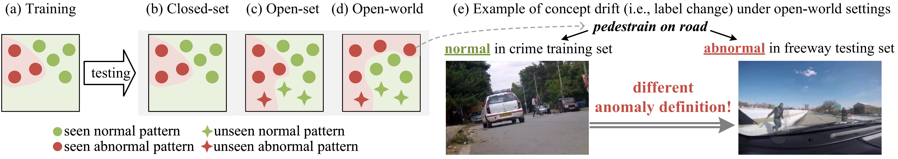

# [ICLR 26] Language-guided Open-world Video Anomaly Detection under Weak Supervision

<p align="center">
    <a href="https://arxiv.org/abs/2503.13160"></a>
    <a href="https://www.modelscope.cn/datasets/Kamino/PreVAD"></a>
    <a href="https://huggingface.co/datasets/Kamino123/PreVAD"></a>
</p>

This repository contains the code and dataset for our ICLR 26 paper "Language-guided Open-world Video Anomaly Detection under Weak Supervision"



Video anomaly detection (VAD) aims to detect anomalies that deviate from what is expected. In open-world scenarios, the expected events may change as requirements change. For example, not wearing a mask may be considered abnormal during a flu outbreak but normal otherwise. However, existing methods assume that the definition of anomalies is invariable, and thus are not applicable to the open world. To address this, we propose a novel open-world VAD paradigm with variable definitions, allowing guided detection through user-provided natural language at inference time. This paradigm necessitates establishing a robust mapping from video and textual definition to anomaly scores. Therefore, we propose LaGoVAD (Language-guided Open-world Video Anomaly Detector), a model that dynamically adapts anomaly definitions with two regularization strategies: diversifying the relative durations of anomalies via dynamic video synthesis, and enhancing feature robustness through contrastive learning with negative mining. Training such adaptable models requires diverse anomaly definitions, but existing datasets typically provide labels without semantic descriptions. To bridge this gap, we collect PreVAD (Pre-training Video Anomaly Dataset), the largest and most diverse video anomaly dataset to date, featuring 35,279 annotated videos with multi-level category labels and descriptions that explicitly define anomalies. Zero-shot experiments on seven datasets demonstrate SOTA performance.

## News

- **[2026.03]** We have released the PreVAD dataset on Hugging Face! 🤗
- **[2026.02]** We have released the code of LaGoVAD! 🔥
- **[2026.02]** Our paper has been accepted to ICLR 2026! 🎉
- **[2025.09]** We have released the annotations and features of PreVAD dataset. We also provide the codes to build the dataset.

## 🗒️ TODO

We are continuously building this repo!

- [x] Release PreVAD annotations and features
- [ ] Release PreVAD raw videos
- [x] Release PreVAD Data Preparation Toolkit
- [x] Release LaGoVAD code
- [ ] Release LaGoVAD weights

## Code Structure

```
├── data
│ ├── other_datasets             # Other datasets
│ │ ├── {dataset}_videos         # Original videos
│ │ └── {dataset}_features       # Extracted features
├── src 
│ ├── main.py                  # **Training**
│ ├── end2end_inference.py     # **End to end inference**
│ ├── full_length_eval.py      # **Full-length evaluation**
│ ├── models 
│ │ ├── LaGoVAD                # Main codes for LaGoVAD
│ │ │ ├── lagovad.py           # Main codes for modeling with LightningModule
│ │ │ ├── configs.py           # Config classes
│ │ │ ├── fusion_encoders.py   # Fusion
│ │ │ ├── heads.py             # Head
│ │ │ ├── losses.py            # Loss
│ │ │ ├── modeling_clip.py     # Text Encoder
│ │ │ ├── temporal_encoders.py # Temporal Encoder
│ │ │ └── verbalizer.py        # Prompts for abnormal categories
│ ├── configs                  # Config yaml files for training
│ ├── datasets
│ │ ├── UCFCrime.py            # Dataset Loaders
│ │ ├── PreVAD.py              # The codes for Dynamic Video Synthesis are here
│ │ └── datamodules.py         # Pytorch Lightning Datamodules
│ └── offline_evals 
├── ckpts                      # Place the pretrained models here
│ ├── best.ckpt
│ ├── config.yaml
│ └── pred_results.pkl         # Predictions of all datasets
├── tools 
│ └── extract_feat_clip.py     # Extract features
├── end2end_inference.sh 
├── evaluation.sh 
├── train.sh 
└── assets 
```

## Environment Preparation

1. Clone the repository:

```bash
git clone https://github.com/Kamino666/LaGoVAD-PreVAD.git
cd LaGoVAD-PreVAD
```

2. Install dependencies:

- **Python**: 3.11
- **PyTorch**: 2.4.0 (CUDA 12.4)
- **Transformers**: 4.56.0

```bash
conda env create -f environment.yaml --name lagovad
conda activate lagovad
```

## Data Preparation

### PreVAD (Training Dataset)

The dataset is available at [ModelScope](https://www.modelscope.cn/datasets/Kamino/PreVAD) and [Hugging Face](https://huggingface.co/datasets/Kamino123/PreVAD).
Please download it and place it in the `data` directory.

If you are interested in the code we used to build this dataset, please refer to the `data_download` folder.

### Test Datasets

1. Download the raw videos for the test datasets and place them in `data/other_datasets/{dataset}_videos` (e.g., `data/other_datasets/ucf_videos`).
2. Extract CLIP features using `tools/extract_feat_clip.py`.

   > **Note**: You need to modify `tools/extract_feat_clip.py` to specify the correct input video directories and output feature directories (e.g., `data/other_datasets/{dataset}_features`) before running.

   ```bash
   python tools/extract_feat_clip.py
   ```

## Usage

### 1. Training

1. Prepare the training and evaluation datasets (see Data Preparation).
2. Run the training script:

   ```bash
   bash train.sh
   ```

### 2. Evaluation

1. Download pretrained models from [here]().
2. Prepare the evaluation dataset (see Data Preparation).
3. Run the evaluation script:

   ```bash
   bash evaluation.sh
   ```

### 3. Inference

1. Download pretrained models from [here]().
2. Run the inference script:

   ```bash
   bash end2end_inference.sh
   ```

## 📑 Citation

```bibtex
@article{liu2025lagovad,
  title={Language-guided Open-world Video Anomaly Detection under Weak Supervision},
  author={Liu, Zihao and Wu, Xiaoyu and Wu, Jianqin and Wang, Xuxu and Yang, Linlin},
  journal={arXiv preprint arXiv:2503.13160},
  year={2025}
}
```
